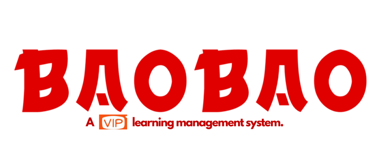

# Bao Bao

## Collaborators: [AgesilausDrako](https://github.com/AgesilausDrako) | [dizDonut](https://github.com/dizDonut) | [jbcurrie](https://github.com/jbcurrie) | [kaibrown](https://github.com/kaibrown) | [RubyDease](https://github.com/RubyDease) | [tbphokie](https://github.com/tbphokie) 

Bao Bao, a full stack application built with the React JS library, is a student management system for VIPKID tutors. 

# [Demo the App](https://baobaotutor.herokuapp.com/)

# [Slide Deck](http://prezi.com/fz9ktptfsuch/?utm_campaign=share&utm_medium=copy&rc=ex0share)

**Technologies:** *React.js, React Router, mongoDB, Mongoose, RESTful APIs, Material UI, React Materialize, React Big Calendar, Moment.js, Node.js, Express.js, bcrypt, heroku, webflow*
